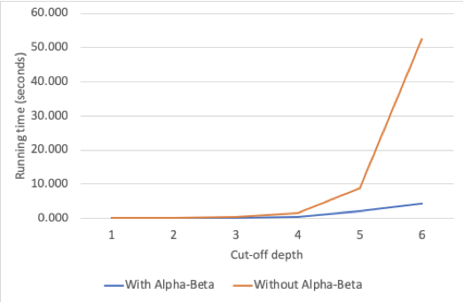

# Connect Four Minimax Agent with Alpha-Beta Pruning

We also wanted to test the effectiveness of alpha-beta pruning. An experiment was run to observe running time at various cutoff depths with and without alpha-beta pruning. Since we are only interested in observing running time, we had the agent of interest, play against the same minimax agent at cut-off depth 1, which would make rational moves very quickly but without looking ahead. In all depths from 2 to 6, the agent with the greater cut-off always beat the agent with depth 1. Also, all games were ensured to be won after having made 20 turns or more in order to have enough data points for a reliable average running time per turn.

